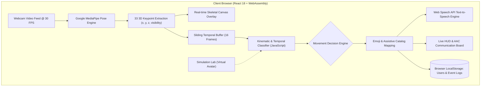

# SignVision AI – Move. Express. Connect.
> **AI-Based Human Movement Recognition and Emoji-Based Communication for People with Mobility Disabilities**  
> *Final-Year Engineering AI/ML Capstone Project*

[](https://ruturaj9901.github.io/Signvision-AI/)
[](https://react.dev)
[](https://vitejs.dev)
[](https://developers.google.com/mediapipe)
[](#-accessibility-features)
[](LICENSE)

---

## 🌐 Live Online Application

Open and immediately use SignVision AI directly in any browser:  
👉 **[https://ruturaj9901.github.io/Signvision-AI/](https://ruturaj9901.github.io/Signvision-AI/)**

> **No installation required!** Runs 100% client-side in the browser using WebAssembly and client-side computer vision.

---

## 📌 Problem Statement & Clinical Relevance

Individuals experiencing severe physical limitations—such as **Amyotrophic Lateral Sclerosis (ALS)**, **Cerebral Palsy**, **Quadriplegia / Paraplegia**, or **Post-Stroke Motor Deficits**—frequently face significant barriers to spoken and written communication.

Traditional Augmentative and Alternative Communication (AAC) systems often require expensive dedicated hardware, invasive eye-trackers, or fine-motor dexterity that many patients cannot physically maintain.

**SignVision AI** introduces an accessible, zero-cost, vision-based assistive solution that operates in any standard browser. By combining real-time human pose estimation with kinematic and temporal action recognition, subtle intentional body and head movements are dynamically transformed into:
1. **Expressive High-Contrast Emojis** (understood universally across cultural and language barriers).
2. **Audible Text-to-Speech (TTS) Voice Synthesis** (allowing patients to verbally address caregivers and family).
3. **Augmentative Emoji Communication Board (AAC)** (categorized daily needs, emergency requests, feelings, and questions).
4. **Persistent Audited Communication Logs** (stored securely in browser `localStorage`).

---

## 🏗️ System Architecture



---

## 🌟 Key Features

### 1. Vision & Gesture Recognition
- **Google MediaPipe Pose**: 33 anatomical 3D landmark points tracked at up to 30 FPS with sub-millisecond inference.
- **Biomechanical Scale Invariance**: Normalizes joint positions against inter-shoulder distance and hip center, rendering recognition immune to user distance from the camera.
- **Dynamic Temporal Analysis**: Rolling temporal buffer detects oscillating movements like hand waving and head nodding without false positives.

### 2. Supported Gestures & Assistive Emojis

| Gesture Name | Emoji | Assistive Spoken Expression | Anatomical Cue |
| :--- | :---: | :--- | :--- |
| **Right Hand Raise** | 🙋‍♂️ | *"I need assistance, please."* | Right wrist elevated above right shoulder |
| **Left Hand Raise** | 🙋 | *"I have a question or need attention."* | Left wrist elevated above left shoulder |
| **Both Hands Raised** | 🙆 | *"Yes! I strongly agree and feel great."* | Both wrists elevated above shoulders |
| **Waving Hand** | 👋 | *"Hello! Nice to see you."* | Wrist elevated with horizontal oscillation |
| **Head Nod** | 🙇 | *"Yes, I understand and agree."* | Cyclic vertical displacement of head/neck |
| **Head Tilt Left** | 🤔 | *"I am thinking / Maybe."* | Neck lateral flexion toward left shoulder |
| **Head Tilt Right** | ❓ | *"Could you clarify that for me?"* | Neck lateral flexion toward right shoulder |
| **Body Lean Left** | 👈 | *"No / Navigate Left / Previous item."* | Torso lateral tilt relative to hips (> 14°) |
| **Body Lean Right** | 👉 | *"Yes / Navigate Right / Next item."* | Torso lateral tilt relative to hips (> 14°) |
| **Hands Together** | 🙏 | *"Thank you so much / Please."* | Wrists centered together at chest level |
| **Open Arms** | 🫂 | *"Welcome! I feel comfortable."* | Both arms extended outwards (> 140°) |
| **Salute** | 🫡 | *"Understood! I am ready."* | Wrist positioned at temple / brow level |
| **Resting / Neutral** | 🧘 | *"Neutral posture. Relaxed."* | Baseline resting posture |

### 3. Simulation Testing Lab (Zero-Webcam Required)
- Built-in **2D Virtual Skeleton Avatar** simulating pre-recorded landmark sequences for all 13 movements.
- Frame-by-frame stepper, speed controls (0.5x, 1x, 2x), and direct recognition pipeline execution for presentation, testing, or environments without a camera.

### 4. Assistive Emoji Communication Board (AAC)
- Categorized touch tiles for **Urgent Needs**, **Social Greetings**, **Responses**, and **Daily Comfort**.
- Real-time sentence strip builder to compose multi-word phrases and speak them with one click.

### 5. Accessibility & Inclusivity (WCAG 2.1)
- **High Contrast Theme**: Pure black background (`#000000`) with high-visibility contrast accents (`#ffff00`, `#00ffff`) for low-vision users.
- **Multi-scale Typography**: Dynamic font size scaling (Normal, Large, Extra Large) without layout clipping.
- **Text-to-Speech Engine**: Web Speech API with customizable rates and automatic audio debounce.

### 6. User Authentication & Session Persistence
- **Sign In / Sign Up Flow**: Real user account registration and validation.
- **One-Click Demo Account**: Pre-seeded demo credentials (`demo` / `demo123`) for instant evaluation.
- **Protected Views**: Dashboard, history, and communication boards are protected behind authentication.
- **Data Persistence**: Account profiles and recognition logs saved automatically in browser `localStorage`.

---

## 📁 Repository Structure

```text
Signvision-AI/
├── .github/
│   └── workflows/
│       └── deploy.yml        # GitHub Actions automated Pages build & deploy
├── docs/                     # Static production build for GitHub Pages /docs branch
│   ├── assets/               # Bundled JavaScript and CSS assets
│   ├── .nojekyll             # Disables Jekyll processing on GitHub Pages
│   ├── 404.html              # SPA routing fallback for GitHub Pages
│   └── index.html            # Entry point for GitHub Pages
├── frontend/                 # React 18 + Vite Source Code
│   ├── public/               # Static assets & 404 handler
│   ├── src/
│   │   ├── components/
│   │   │   ├── AboutTech.jsx             # Technical architecture & project specs
│   │   │   ├── AuthModal.jsx             # Accessible Sign In / Sign Up component
│   │   │   ├── Dashboard.jsx             # Live camera HUD & real-time prediction
│   │   │   ├── EmojiCommunicator.jsx     # AAC board with sentence strip composer
│   │   │   ├── GestureReferenceModal.jsx # Visual gesture catalog modal
│   │   │   ├── Navbar.jsx                # Navigation, profile badge & accessibility
│   │   │   ├── PoseCamera.jsx            # MediaPipe canvas overlay & video capture
│   │   │   ├── RecognitionHistory.jsx    # Event log table, search & CSV/JSON export
│   │   │   └── SimulationMode.jsx        # 2D virtual avatar sandbox
│   │   ├── services/
│   │   │   ├── api.js                    # Standalone client service
│   │   │   ├── gesturesData.js           # Catalog of gestures & assistive phrases
│   │   │   ├── movementClassifier.js     # Kinematic & temporal rules engine
│   │   │   ├── simulationData.js         # Synthetic pose landmark generator
│   │   │   ├── storageService.js         # LocalStorage user auth & history logs
│   │   │   └── tts.js                    # Web Speech API & audio chimes
│   │   ├── App.jsx                       # Root routing & state coordinator
│   │   ├── index.css                     # Design system & high-contrast theme
│   │   └── main.jsx                      # Frontend entrypoint
│   ├── index.html            # Web page with MediaPipe CDN
│   ├── package.json          # Dependencies (React, Lucide, Canvas-Confetti)
│   └── vite.config.js        # Vite config with base path /Signvision-AI/
├── backend/                  # (Optional) Python FastAPI Backend
│   ├── classifier.py         # Modular model connector
│   ├── database.py           # SQLite persistence layer
│   ├── gestures_data.py      # Gestures catalog
│   ├── main.py               # REST API server
│   └── schemas.py            # Pydantic models
├── models/                   # Modular AI/ML Model Training Layer
│   ├── base_classifier.py    # Abstract base class for recognition models
│   ├── heuristic_classifier.py# Python spatial kinematics engine
│   ├── lstm_classifier.py    # Temporal BiLSTM model scaffold
│   ├── train_lstm.py         # Synthetic landmark generator & training script
│   └── gesture_weights.json  # Exported model weights
├── .env.example              # Environment variables template
├── .gitignore                # Comprehensive Git ignore rules
├── package.json              # Root project package runner
├── requirements.txt          # Python packages (fastapi, uvicorn, sqlalchemy)
├── start.bat                 # 🚀 One-click Windows master launcher
├── start_frontend.bat        # Windows launcher for Web server
└── start_backend.bat         # Optional Windows launcher for FastAPI
```

---

## 🚀 Deployment to GitHub Pages

Deploying your repository to GitHub Pages takes less than 1 minute:

### Method A: Automated GitHub Actions (Recommended)
1. Push this repository to GitHub: `https://github.com/ruturaj9901/Signvision-AI`
2. In your GitHub repository, navigate to **Settings** > **Pages**.
3. Under **Build and deployment** > **Source**, select **GitHub Actions**.
4. That's it! The included `.github/workflows/deploy.yml` workflow will automatically build and deploy your site on every push to `main`!
5. Your website will be live at:  
   `https://ruturaj9901.github.io/Signvision-AI/`

### Method B: Deploy from Branch (`/docs` folder)
1. Push this repository to GitHub.
2. In GitHub, go to **Settings** > **Pages**.
3. Under **Build and deployment** > **Source**, choose **Deploy from a branch**.
4. Select branch **`main`** (or `master`) and folder **`/docs`**.
5. Click **Save**. Within 60 seconds, your site is live!

---

## 💻 Running Locally on Windows

You can also run the project locally offline on any Windows computer:

### Option 1: One-Click Startup (No manual setup!)
Double-click:
```bat
start.bat
```
* Automatically verifies Node.js and installs npm dependencies if needed.
* Launches the development web server.
* Automatically opens your default web browser to: `http://localhost:3000/Signvision-AI/`

---

### Option 2: Manual Terminal Commands
If you prefer running manual commands in PowerShell or Command Prompt:

```bash
# 1. Clone your repository
git clone https://github.com/ruturaj9901/Signvision-AI.git
cd Signvision-AI

# 2. Navigate to frontend & install dependencies
cd frontend
npm install

# 3. Start local development server
npm run dev
```

Open your browser to:
👉 `http://localhost:3000/Signvision-AI/`

---

## 📖 How to Use the Application

1. **Authentication**:
   - On initial launch, you will see the **SignVision AI Authentication Portal**.
   - Click **One-Click Demo Account** (or enter `demo` / `demo123`) to immediately log in.
   - Alternatively, click **Sign Up Now** to create a custom user account.
2. **Live Camera Recognition**:
   - Navigate to **Live Camera HUD**.
   - Click **Start Camera** and grant camera permission in your browser.
   - Position yourself ~2–4 feet from the webcam so your head, shoulders, and hands are visible.
   - Perform any supported gesture (e.g. raise your right hand, wave, nod, or lean left/right).
   - SignVision AI will immediately identify the movement, display the associated emoji, animate the card, and speak the assistive phrase via Text-to-Speech!
3. **Simulation Mode**:
   - If you do not have a webcam or prefer testing offline, click **Simulation Lab**.
   - Select any gesture from the catalog to see the **2D Virtual Skeleton Avatar** perform it in a smooth animated loop.
   - Inspect frame numbers, test varying playback speeds (0.5x, 1x, 2x), and click **Save Expression to History**.
4. **Emoji AAC Communication Board**:
   - Navigate to **Emoji Board** to access touch/click communication tiles organized into **Urgent Needs**, **Social**, **Responses**, and **Comfort**.
   - Tap individual tiles to speak single requests, or build sentences in the **Live Sentence Strip** and click **Speak Full Sentence**.
5. **Recognition History & Export**:
   - Open **History & Logs** to audit all detected gestures with timestamps, confidence ratings, and source tags.
   - Use the **Search bar** or **Source filter** to find specific events.
   - Click **CSV** or **JSON** to download the audited communication logs directly to your computer.
   - Click **Clear History** to reset logs stored in your browser.

---

## 🎓 Academic Viva & Technical Evaluation Highlights

1. **Why is in-browser MediaPipe Pose preferred over server-side video streaming?**
   - Video streaming to a server incurs heavy bandwidth costs, network latency (200–500ms), and privacy concerns (streaming video of patients over the web). MediaPipe Pose runs **locally inside the user's browser WebAssembly sandbox at 30+ FPS**, ensuring absolute patient privacy, zero server costs, and instant feedback.
2. **How does the system ensure distance and scale invariance?**
   - The classifier computes the Euclidean distance between left and right shoulders (`shoulder_width = dist(L_shoulder, R_shoulder)`). All elevation thresholds, wrist displacements, and head movements are evaluated as ratios of `shoulder_width`, meaning the user can sit close to or far from the camera without affecting accuracy.
3. **How are static postures differentiated from dynamic gestures?**
   - Static postures (Hand Raise, Salute, Hands Together, Lean) are classified on instantaneous single-frame joint angles. Dynamic gestures (Hand Wave, Head Nod) inspect horizontal/vertical velocity direction zero-crossings and variance across a 16-frame sliding temporal buffer.

---

## 📄 License

This project is licensed under the **MIT License** — free for academic, non-commercial, and assistive technology development.
